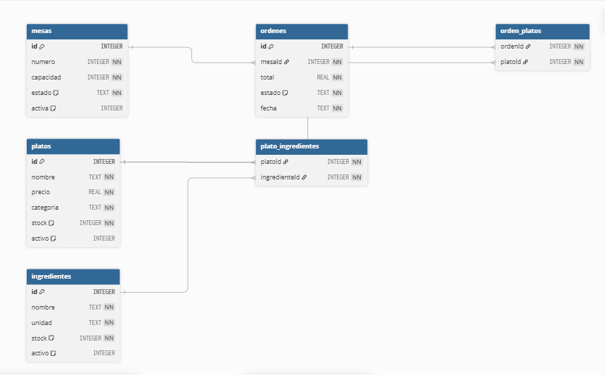

# API REST Restaurante – SENA

## Descripción
API REST desarrollada con Node.js, Express.js y SQLite para un sistema de restaurante. Implementa CRUD completo para 4 recursos: Platos, Ingredientes, Mesas y Órdenes.

## Diagrama ER


## Diccionario de Datos

### Tabla: mesas
| Campo | Tipo | PK | FK | Restricción | Descripción |
|-------|------|----|----|-------------|-------------|
| id | INTEGER | SI | NO | AUTOINCREMENT | Identificador único |
| numero | INTEGER | NO | NO | NOT NULL, UNIQUE | Número de la mesa |
| capacidad | INTEGER | NO | NO | NOT NULL, > 0 | Cantidad de personas |
| estado | TEXT | NO | NO | NOT NULL, DEFAULT 'disponible' | disponible / ocupada |
| activa | INTEGER | NO | NO | DEFAULT 1 | 1 = activa, 0 = inactiva |

### Tabla: ordenes
| Campo | Tipo | PK | FK | Restricción | Descripción |
|-------|------|----|----|-------------|-------------|
| id | INTEGER | SI | NO | AUTOINCREMENT | Identificador único |
| mesaId | INTEGER | NO | SI | NOT NULL, FK -> mesas.id | Mesa que hizo la orden |
| total | REAL | NO | NO | NOT NULL, > 0 | Total de la orden |
| estado | TEXT | NO | NO | NOT NULL, DEFAULT 'pendiente' | pendiente / entregada / cancelada |
| fecha | TEXT | NO | NO | NOT NULL | Fecha de la orden |

### Tabla: platos
| Campo | Tipo | PK | FK | Restricción | Descripción |
|-------|------|----|----|-------------|-------------|
| id | INTEGER | SI | NO | AUTOINCREMENT | Identificador único |
| nombre | TEXT | NO | NO | NOT NULL, UNIQUE | Nombre del plato |
| precio | REAL | NO | NO | NOT NULL, > 0 | Precio de venta |
| categoria | TEXT | NO | NO | NOT NULL | Tipo de plato |
| stock | INTEGER | NO | NO | NOT NULL, >= 0 | Unidades disponibles |
| activo | INTEGER | NO | NO | DEFAULT 1 | 1 = activo, 0 = inactivo |

### Tabla: ingredientes
| Campo | Tipo | PK | FK | Restricción | Descripción |
|-------|------|----|----|-------------|-------------|
| id | INTEGER | SI | NO | AUTOINCREMENT | Identificador único |
| nombre | TEXT | NO | NO | NOT NULL, UNIQUE | Nombre del ingrediente |
| unidad | TEXT | NO | NO | NOT NULL | kg, litros, unidades, etc. |
| stock | INTEGER | NO | NO | NOT NULL, >= 0 | Cantidad disponible |
| activo | INTEGER | NO | NO | DEFAULT 1 | 1 = activo, 0 = inactivo |

## Tecnologías
- Node.js v22
- Express.js
- SQLite3
- Thunder Client / Postman

## Instalación
```bash
npm install
node index.js
```

## Estructura del proyecto
```
restaurante/
├── index.js
├── db.js
├── database.db
├── package.json
├── assets/
│   └── diagrama-er.png
└── routes/
    ├── platos.js
    ├── ingredientes.js
    ├── mesas.js
    └── ordenes.js
```

## Endpoints

### Platos
| Método | Ruta | Descripción |
|--------|------|-------------|
| GET | /platos | Lista todos los platos (soporta filtro por query) |
| GET | /platos/:id | Obtiene un plato por ID |
| POST | /platos | Crea un nuevo plato |
| PUT | /platos/:id | Actualiza un plato existente |
| DELETE | /platos/:id | Elimina un plato |

### Ingredientes
| Método | Ruta | Descripción |
|--------|------|-------------|
| GET | /ingredientes | Lista todos los ingredientes (soporta filtro por query) |
| GET | /ingredientes/:id | Obtiene un ingrediente por ID |
| POST | /ingredientes | Crea un nuevo ingrediente |
| PUT | /ingredientes/:id | Actualiza un ingrediente existente |
| DELETE | /ingredientes/:id | Elimina un ingrediente |

### Mesas
| Método | Ruta | Descripción |
|--------|------|-------------|
| GET | /mesas | Lista todas las mesas (soporta filtro por query) |
| GET | /mesas/:id | Obtiene una mesa por ID |
| POST | /mesas | Crea una nueva mesa |
| PUT | /mesas/:id | Actualiza una mesa existente |
| DELETE | /mesas/:id | Elimina una mesa |

### Órdenes
| Método | Ruta | Descripción |
|--------|------|-------------|
| GET | /ordenes | Lista todas las órdenes (soporta filtro por query) |
| GET | /ordenes/:id | Obtiene una orden por ID |
| POST | /ordenes | Crea una nueva orden |
| PUT | /ordenes/:id | Actualiza el estado de una orden |
| DELETE | /ordenes/:id | Cancela/elimina una orden |

## Ejemplos de uso

### Filtro por query params
```
GET /platos?categoria=sopa
GET /mesas?estado=disponible
```

### Header requerido
```
Authorization: Bearer mi-token-123
```

### Ejemplo POST /platos
```json
{
  "nombre": "Cazuela de Mariscos",
  "precio": 32000,
  "categoria": "plato fuerte",
  "stock": 5
}
```

### Ejemplo POST /ordenes
```json
{
  "mesaId": 1,
  "total": 43000
}
```

## Integrantes
| Nombre | Rol |
|--------|-----|
| Samuel Osorio | Tech Lead / Backend Developer |

## Programa
SENA – Tecnología en Análisis y Desarrollo de Software  
Instructor: Mateo